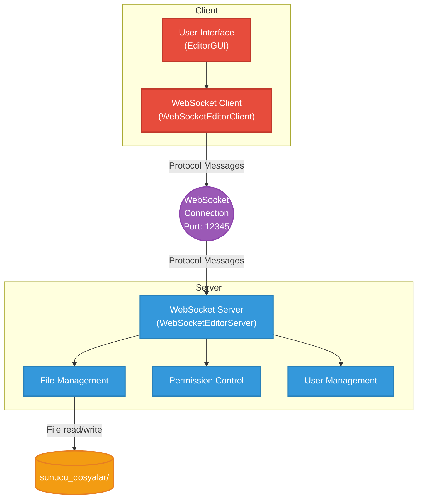

# Multi-User Editor with WebSocket

This project is a multi-user text editor that uses an FTP-like message structure for client-server communication. The code aims for consistency and clarity with a simple constructor-based approach.

## 🚀 Features

- **FTP-Like Protocol**: Clear message structure with header and content separation.
- **Real-Time Editing**: Multiple users can work on the same file simultaneously.
- **File Management**: Create, list, and save files on the server.
- **Permission System**: Access control based on file owner and editors.
- **WebSocket Connection**: Fast, bidirectional communication.
- **Constructor-Based Protocol**: Intuitive and consistent message creation and parsing.
- **Modern UI**: Tab-based interface with multi-file support.

## 📋 Protocol Structure

### Message Format
The protocol consists of a single line in `UTF-8` format. The header and content are separated by the `CONTENT:` keyword.

```
HEADER[;CONTENT:BASE64_CONTENT]
```

### Header Format
The header includes the command, arguments, status code, and timestamp. These fields are separated by `;`, and arguments are separated by `,`.

```
COMMAND;ARG1,ARG2,...;STATUS_CODE;TIMESTAMP
```

### Example Messages

#### Login Message (No Content)
`LOGIN;user123;200 OK;1673778600000`

#### Edit Message (With Content)
`EDIT;user123,file.txt;200 OK;1673778600000;CONTENT:SGVsbG8gV29ybGQ=`

#### File List Response (With Content)
`LIST_FILES_RESPONSE;;200 OK;1673778600000;CONTENT:file1.txt,file2.txt`

## 🛠️ Setup and Running

### 1. Compile
```bash
javac -cp "lib/*" src/server/*.java src/client/*.java src/common/*.java
```

### 2. Run

#### Direct Run (Recommended)
```bash
# Server
java -cp "lib/*;out" server.ServerMain

# Client (in a new terminal window)
java -cp "lib/*;out" client.ClientMain
```

#### Manual Compilation
```bash
javac -cp "lib/*" -d out src/common/Protocol.java src/client/WebSocketEditorClient.java src/client/EditorGUI.java src/common/ButtonTabComponent.java src/server/WebSocketEditorServer.java src/server/ServerMain.java src/Main.java
```

## 📁 Project Structure

```
src/
├── common/
│   ├── Protocol.java              # Constructor-based protocol class
│   └── ButtonTabComponent.java    # Tab close component
├── client/
│   ├── ClientMain.java            # Client main class
│   ├── EditorGUI.java             # User interface
│   └── WebSocketEditorClient.java # WebSocket client
├── server/
│   ├── ServerMain.java            # Server main class
│   └── WebSocketEditorServer.java # WebSocket server
└── Main.java                      # Simple main class
```

## 🏗️ Architecture

The project uses a simple architecture where the client and server communicate over WebSocket. The server manages file operations and authorization logic, while the client handles the user interface and communication with the server.



## 🔧 Protocol Commands

### Client → Server
- `LOGIN` - Logs in the user.
- `CREATE_FILE` - Creates a new file.
- `EDIT` - Edits file content and sends it to the server.
- `LIST_FILES_REQUEST` - Requests the list of files from the server.
- `CHECK_PERMISSION` - Checks permission for a file.
- `GET_EDITORS` - Requests the list of editors for a file.
- `SET_EDITORS` - Updates the list of editors (owner only).
- `LEAVE_FILE` - Leaves the active file.

### Server → Client
- `SUCCESS` - Indicates a successful operation.
- `ERROR` - Sends an error message (e.g., `FILE_NOT_FOUND`, `PERMISSION_DENIED`).
- `EDIT` - Notifies about file content changes by another user.
- `LIST_FILES_RESPONSE` - Sends the list of files.
- `EDITORS_LIST` - Sends the current list of editors for a file.
- `ACTIVE_USERS` - Updates the list of active users connected to the server.
- `PERMISSION_GRANTED` - Grants access to a file and sends its content.
- `PERMISSION_DENIED` - Denies access to a file.

## 💡 Using the Constructor Approach

The Protocol class provides static factory methods for easy and error-free message creation.

### Creating Messages (Factory Methods)
```java
// Login message
Protocol login = Protocol.login("user123");

// Edit message
Protocol edit = Protocol.edit("user123", "file.txt", "new content");

// Success message
Protocol success = Protocol.success("File created successfully!");

// Error message
Protocol error = Protocol.fileNotFound("file.txt");
```

### Parsing Messages
An incoming text message can be converted to a `Protocol` object using the `deserialize` method.
```java
Protocol msg = Protocol.deserialize(rawMessage);
String command = msg.getCommand();
String[] args = msg.getArgs();
String content = msg.getContent();
```

### Convenience Methods
Helper methods are available for easier access to message content.
```java
// Get username
String username = msg.getUsername();

// Get file name
String filename = msg.getFileName();

// Get argument
String firstArg = msg.getArg(0);
```

## 🎯 Usage

1. **Start the Server**: `java -cp "lib/*;out" server.ServerMain`
2. **Start the Client**: `java -cp "lib/*;out" client.ClientMain`
3. **Enter Username**: Enter your username when the client starts
4. **Select/Create File**: Select an existing file or create a new one
5. **Edit**: Make changes in the text area
6. **Save**: Changes are saved automatically

## 🔒 Security

- Only the file owner can change the list of editors
- Permission checks are performed for every operation
- Base64 encoding ensures binary-safe content transfer
- Null checks improve security

## 📝 Notes

- Server files are stored in the `sunucu_dosyalar/` directory
- WebSocket connection runs on port 12345
- You must enter a username when starting the client
- The server must be started before the client connects
