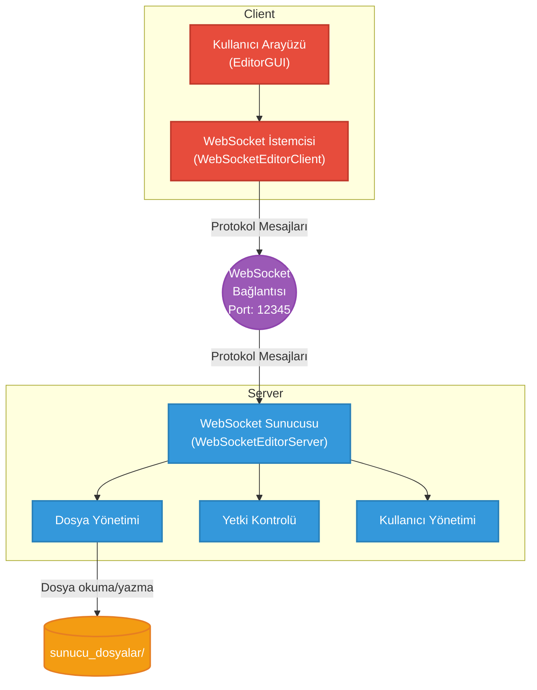

# Çok Kullanıcılı Editör - Constructor Tabanlı Protokol

Bu proje, sunucu-istemci haberleşmesi için FTP benzeri bir mesaj yapısı kullanan çok kullanıcılı bir metin editörüdür. Basit constructor yaklaşımı ile tutarlı ve anlaşılır kod yapısı hedeflenmiştir.

## 🚀 Özellikler

- **FTP Benzeri Protokol**: Başlık ve içerik ayrımı ile net mesaj yapısı.
- **Gerçek Zamanlı Düzenleme**: Birden fazla kullanıcı aynı anda aynı dosya üzerinde çalışabilir.
- **Dosya Yönetimi**: Sunucu üzerinde dosya oluşturma, listeleme ve kaydetme.
- **Yetki Sistemi**: Dosya sahibi ve editör bazlı erişim kontrolü.
- **WebSocket Bağlantısı**: Hızlı ve çift yönlü iletişim.
- **Constructor Tabanlı Protokol**: Anlaşılır ve tutarlı mesaj oluşturma ve ayrıştırma.
- **Modern UI**: Sekme tabanlı arayüz ile çoklu dosya desteği.

## 📋 Protokol Yapısı

### Mesaj Formatı
Protokol, `UTF-8` formatında tek bir satırdan oluşur. Başlık ve içerik `CONTENT:` anahtar kelimesi ile ayrılır.

```
HEADER[;CONTENT:BASE64_ICERIK]
```

### Başlık Formatı
Başlık; komut, argümanlar, durum kodu ve zaman damgasından oluşur. Bu alanlar `;` karakteri ile ayrılır. Argümanlar ise kendi içinde `,` ile ayrılır.

```
COMMAND;ARG1,ARG2,...;STATUS_CODE;TIMESTAMP
```

### Örnek Mesajlar

#### Login Mesajı (İçeriksiz)
`LOGIN;user123;200 OK;1673778600000`

#### Edit Mesajı (İçerikli)
`EDIT;user123,file.txt;200 OK;1673778600000;CONTENT:SGVsbG8gV29ybGQ=`

#### Dosya Listesi Yanıtı (İçerikli)
`LIST_FILES_RESPONSE;;200 OK;1673778600000;CONTENT:file1.txt,file2.txt`

## 🛠️ Kurulum ve Çalıştırma

### 1. Derleme
```bash
javac -cp "lib/*" src/server/*.java src/client/*.java src/common/*.java
```

### 2. Çalıştırma

#### Doğrudan Çalıştırma (Önerilen)
```bash
# Sunucu
java -cp "lib/*;out" server.ServerMain

# İstemci (yeni terminal penceresinde)
java -cp "lib/*;out" client.ClientMain
```

#### Manuel Derleme
```bash
javac -cp "lib/*" -d out src/common/Protocol.java src/client/WebSocketEditorClient.java src/client/EditorGUI.java src/common/ButtonTabComponent.java src/server/WebSocketEditorServer.java src/server/ServerMain.java src/Main.java
```

## 📁 Proje Yapısı

```
src/
├── common/
│   ├── Protocol.java          # Constructor tabanlı protokol sınıfı
│   └── ButtonTabComponent.java # Sekme kapatma bileşeni
├── client/
│   ├── ClientMain.java        # İstemci ana sınıfı
│   ├── EditorGUI.java         # Kullanıcı arayüzü
│   └── WebSocketEditorClient.java # WebSocket istemcisi
├── server/
│   ├── ServerMain.java        # Sunucu ana sınıfı
│   └── WebSocketEditorServer.java # WebSocket sunucusu
└── Main.java                  # Basit ana sınıf
```

## 🏗️ Mimari

Proje, istemci ve sunucu arasında WebSocket üzerinden haberleşen basit bir mimariye sahiptir. Sunucu, dosya işlemleri ve yetkilendirme mantığını yönetirken, istemci kullanıcı arayüzünü ve sunucuyla iletişimi sağlar.



## 🔧 Protokol Komutları

### İstemci → Sunucu
- `LOGIN` - Kullanıcı girişi yapar.
- `CREATE_FILE` - Yeni dosya oluşturur.
- `EDIT` - Dosya içeriğini düzenler ve sunucuya gönderir.
- `LIST_FILES_REQUEST` - Sunucudaki dosya listesini ister.
- `CHECK_PERMISSION` - Dosya için yetki kontrolü yapar.
- `GET_EDITORS` - Dosyanın editör listesini ister.
- `SET_EDITORS` - Dosyanın editör listesini günceller (sadece dosya sahibi).
- `LEAVE_FILE` - Aktif dosyadan ayrılır.

### Sunucu → İstemci
- `SUCCESS` - İşlemin başarılı olduğunu bildirir.
- `ERROR` - Hata mesajı gönderir (örn: `FILE_NOT_FOUND`, `PERMISSION_DENIED`).
- `EDIT` - Başka bir kullanıcı tarafından yapılan dosya içeriği değişikliğini iletir.
- `LIST_FILES_RESPONSE` - Dosya listesini gönderir.
- `EDITORS_LIST` - Dosyanın güncel editör listesini gönderir.
- `ACTIVE_USERS` - Sunucuya bağlı aktif kullanıcı listesini günceller.
- `PERMISSION_GRANTED` - Dosyaya erişim izni verildiğini ve içeriğini gönderir.
- `PERMISSION_DENIED` - Dosyaya erişim izninin reddedildiğini bildirir.

## 💡 Constructor Yaklaşımı Kullanımı

Protokol sınıfı, `static factory` metotları kullanarak mesajların kolay ve hatasız bir şekilde oluşturulmasını sağlar.

### Mesaj Oluşturma (Factory Metotları)
```java
// Login mesajı
Protocol login = Protocol.login("user123");

// Edit mesajı
Protocol edit = Protocol.edit("user123", "file.txt", "yeni içerik");

// Başarı mesajı
Protocol success = Protocol.success("Dosya başarıyla oluşturuldu!");

// Hata mesajı
Protocol error = Protocol.fileNotFound("file.txt");
```

### Mesaj Ayrıştırma
Gelen bir metin mesajı `deserialize` metodu ile bir `Protocol` nesnesine dönüştürülür.
```java
Protocol msg = Protocol.deserialize(rawMessage);
String command = msg.getCommand();
String[] args = msg.getArgs();
String content = msg.getContent();
```

### Kolaylık Metodları
Mesaj içeriğine daha kolay erişim için yardımcı metotlar mevcuttur.
```java
// Kullanıcı adı alma
String username = msg.getUsername();

// Dosya adı alma
String filename = msg.getFileName();

// Argüman alma
String firstArg = msg.getArg(0);
```

## 🎯 Kullanım

1. **Sunucuyu Başlat**: `java -cp "lib/*;out" server.ServerMain`
2. **İstemciyi Başlat**: `java -cp "lib/*;out" client.ClientMain`
3. **Kullanıcı Adı Gir**: İstemci başladığında kullanıcı adınızı girin
4. **Dosya Seç/oluştur**: Mevcut dosyaları seçin veya yeni dosya oluşturun
5. **Düzenleme Yap**: Metin alanında değişiklik yapın
6. **Kaydet**: Değişiklikler otomatik olarak kaydedilir

## 🔒 Güvenlik

- Dosya sahibi sadece dosya sahibi düzenleyicileri değiştirebilir
- Yetki kontrolü her işlemde yapılır
- Base64 encoding ile binary-safe içerik aktarımı
- Null kontrolü ile güvenlik artırıldı

## 📝 Notlar

- Sunucu dosyaları `sunucu_dosyalar/` klasöründe saklanır
- WebSocket bağlantısı port 12345'te çalışır
- İstemci başlatıldığında kullanıcı adı girmeniz gereklidir
- Sunucu önce başlatılmalı, sonra istemci bağlanmalıdır 